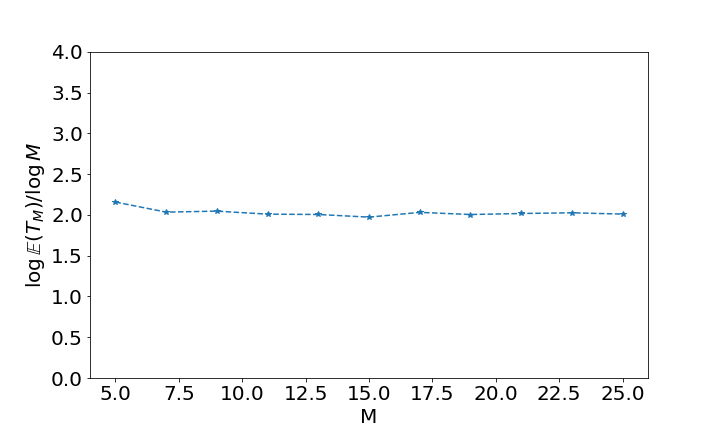
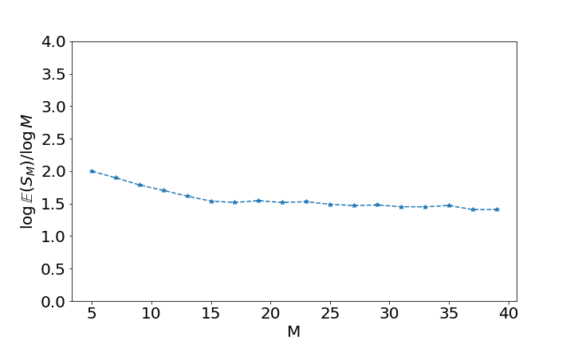

# StrongStationaryTimes

## Introduction

We consider a certain random walk on the Heisenberg group, with coefficients valued in $\mathbb{Z}/ M \mathbb{Z}$. In the jupyter notebook
```bash
$ ./iynb/RandomWalk.ipynb
```
we showcase the sampling of trajectories, and analyze the convergence speed to equilibrium.

This repository is an implementation of strong stationary times, following the paper [Strong stationary times for finite Heisenberg walks](https://hal.archives-ouvertes.fr/hal-03016958) by [Laurent Miclo](https://perso.math.univ-toulouse.fr/miclo/). It is structured as follows.
```bash
--- ./iynb/:                    Contains jupyter notebooks for demo
 |- ./strong_stationary_times/: Core of the repository
 |- ./tests/:                   Unit tests for the core

```

In particular, ```./iynb/StrongTimes.ipynb``` samples iid realizations of two stopping times $T_M$ and $S_M$ suggested in the aforementioned paper. 




The file ```./iynb/Multiprocessed_StrongTimes.ipynb``` showcases the same thing, using Python's multiprocessing for parallel excecution on multiple cores. (Warning: This needs Python>=3.8)

## Installation for Linux

1. Create new virtual environment

```bash
$ python3 -m venv .virtualenv
```

(Do
sudo apt install python3-venv
if needed)

3. Activate virtual environment

```bash
$ source .virtualenv/bin/activate
```

4. Upgrade pip, wheel and setuptools 

```bash
$ pip install --upgrade pip
$ pip install --upgrade setuptools
$ pip install wheel
```

5. Install the `strong_stationary_times` package.

```bash
python setup.py develop
```

6. (Optional) In order to use Jupyter with this virtual environment .virtualenv (see this [blog](https://janakiev.com/blog/jupyter-virtual-envs/) for details)
```bash
pip install ipykernel
python -m ipykernel install --user --name=.virtualenv
```

## Configuration
Nothing to do
